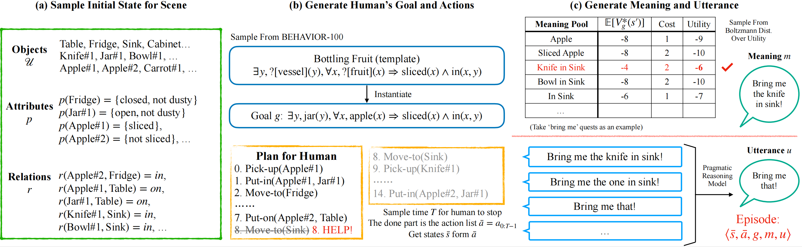

# HandMeThat-Release

**THIS REPO IS DEPRECATED!** Please visit [https://github.com/Simon-Wan/HandMeThat/](https://github.com/Simon-Wan/HandMeThat/).

This is the code used to train and evaluate agents on the HandMeThat dataset.

<div align="center">
  
</div>


**[HandMeThat: Human-Robot Communication in Physical and Social Environments
](https://openreview.net/pdf?id=nUTemM6v9sv)**

[Yanming Wan*](https://sites.google.com/view/wanyanming), 
[Jiayuan Mao*](http://jiayuanm.com), and
[Joshua B. Tenenbaum](https://web.mit.edu/cocosci/josh.html)

[[Paper]](https://openreview.net/pdf?id=nUTemM6v9sv)
[[Supplementary Material]](https://openreview.net/attachment?id=nUTemM6v9sv&name=supplementary_material)
[[Project Page]](https://sites.google.com/view/hand-me-that/)
(* indicates equal contributions.)

## Prerequisites

### Install Source
Clone this repository:
```bash
git clone https://github.com/Simon-Wan/HandMeThat-Release
```

Clone the third party repositories ([XTX](https://sites.google.com/princeton.edu/xtx), [ALFWorld](https://alfworld.github.io/)):
```bash
git clone https://github.com/princeton-nlp/XTX.git
git clone https://github.com/alfworld/alfworld.git
```
Add the packages to your `PYTHONPATH` environment variable.
```bash
export PYTHONPATH=.:$PYTHONPATH:<path_to_xtx>:<path_to_alfworld>
```

### Create a Conda Environment
Create a conda environment for HandMeThat, and install the requirements.
```bash
conda create -n hand-me-that python=3.9
conda activate hand-me-that
conda install pytorch torchvision torchaudio cudatoolkit=11.3 -c pytorch
conda install numpy scipy pyyaml networkx tabulate
conda install h5py tqdm click transformers
conda install -c conda-forge importlib_metadata
pip install jericho lark textworld opencv-python ai2thor jacinle
python -m spacy download en_core_web_sm
```
This includes the required python packages from the third-party repositories.


### Prepare the HandMeThat Dataset
Download the dataset from [Google Drive link
](https://drive.google.com/file/d/1QoCL5veGnuJNhK1mMDryCrvpwVXTupdI/view?usp=sharing) and place the zipped file at `./data`.


Unzip the dataset so that `./data/HandMeThat_with_expert_demonstration` is a folder containing 10,000 json files.
The data split information is presented in `./data/HandMeThat_data_info.json`.

## Quickstart

Play a HandMeThat game:
```python
from handmethat.envs.jericho_env import HMTJerichoEnv
import numpy as np
step_limit = 40
dataset = './data/HandMeThat_with_expert_demonstration'
eval_env = HMTJerichoEnv(dataset, split='test', fully=False, step_limit=step_limit)
obs, info = eval_env.reset()
print(obs.replace('. ', '.\n'))
for _ in range(step_limit):
    action = input('> ')
    # uncomment the following part to get started with a random agent instead
    # _ = input('Press [Enter] to continue')
    # action = np.random.choice(info['valid'])
    # print('Action:', action)
    obs, reward, done, info = eval_env.step(action)
    print(obs.replace('. ', '.\n'), '\n\n')
    if done:
        break
print('moves: {}, score: {}'.format(info['moves'], info['score']))
```
Run `python main.py` to execute the quickstart code.

## Training and Evaluation

This current release contains the basic training setting for Seq2Seq, DRRN, and offline-DRRN models. 
The models can be evaluated on validation and test split.

We tested each model on both fully- and partially-observable setting on all four hardness levels. 
These experiment results are presented in the main paper and supplementary materials. 
The hyperparameter we used are the default values in this released repository.

### DRRN / offline-DRRN

To train the model (e.g., 'DRRN' with 'fully' observable setting):
```bash
python scripts/train_rl.py --model DRRN --observability fully
```

To evaluate the model (e.g., validate) on specific hardness level (e.g., level1):
```bash
python scripts/eval_rl.py --model DRRN --observability fully --level level1 --eval_split validate --memory_file memory_5 --weight_file weights_5
```

Use `--model offlineDRRN` for offline-DRRN setting.

### Seq2Seq

To train the model (e.g., 'partially' observable setting):
```bash
python scripts/train_seq.py --observability partially
```

To evaluate the model (e.g., test) on specific hardness level (e.g., level1):
```bash
python scripts/eval_seq.py --observability partially --level level1 --eval_split test --eval_model_name weights_50000.pt
```

### Random Agent

To evaluate the random agent:

```bash
python scripts/eval.py --agent random --level level1 --eval_split test
```
